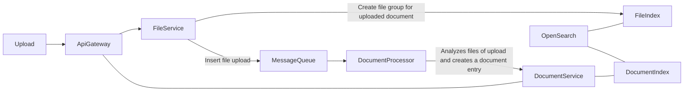

# Upload use case



## File Service

Documents can be uploaded via the file service. It receives a stream of DocumentUpload.

```proto
service UploadService {
  rpc UploadDocuments(stream DocumentUpload) returns (DocumentUploadResult)
}

message DocumentUpload {
  repeated FileUpload files
}

message FileUpload {
  string filename
  string filetype
  byte data
}

message DocumentUploadResult {

}

````

Each document upload receives each FileUpload. The files are either saved as base64 or on some file storage. Eitherway each file gets an entry in the index. The file service generates their ids.

The file service creates a new entry in the MessageQueue which contains all file ids of a document.

## DocumentProcessor

The DocumentProcessor receives its work from the MessageQueue. It streams all files of a new document, analyzes them and creates a document of it. The document is stored via the DocumentService in the index.

## DocumentService

The document service handles all searches, inserts, updates and notifications for the document index.

## ApiGateway

The interface which all clients will use. It will support partially GRPC and GraphQL. 