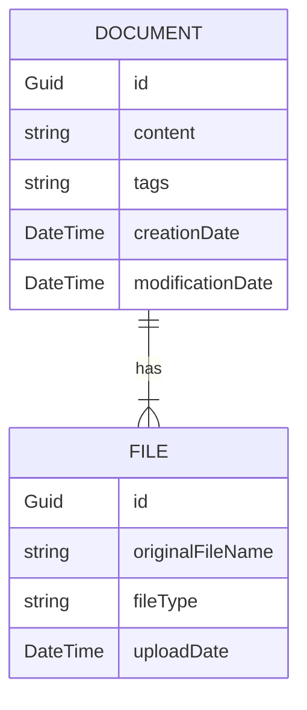

# Overview

## Document

A Document represents a list of files. For example a letter can be scanned into two images. This letter is a Document and its content is the merged content of both images.

## File

A File is a part of a Document. It is the source material for the content of the Document.